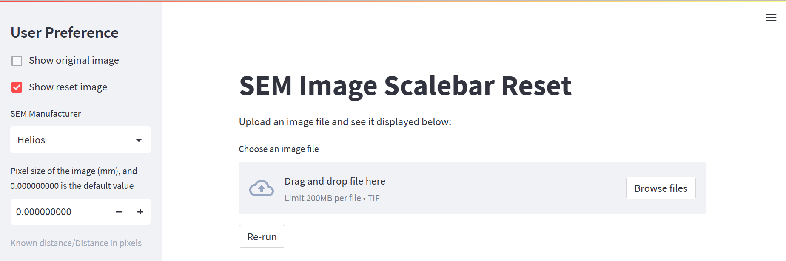
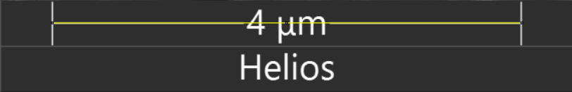
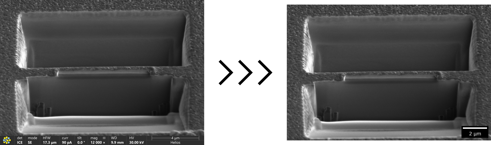

# SEM-Image-Scalebar-Reset

This program assists in cropping the bottom information bar of the SEM image and adds a new scale bar.

## Usage

[//]: # ([![Streamlit App]&#40;https://static.streamlit.io/badges/streamlit_badge_black_white.svg&#41;]&#40;https://jameschung821-sem-image-scalebar-rese-sem-scalebar-reset-stt8wz.streamlit.app/&#41;)

### 1. Define the user input
### 2. Upload the SEM image
### 3. Update the pixel size in nm if needed

  

Known distance in nm / Distance in pixels = Pixel size (nm/pixel)

e.g. 4000 nm (4 um) / 711 pixels = 5.626 nm/pixel, and then set the pixel size to 5.63

### 4. Download the cropped image with a new scale bar

