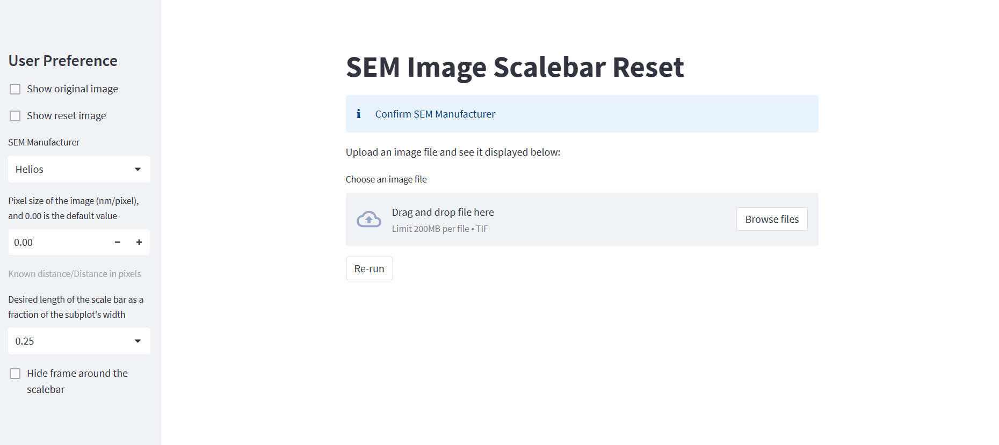

# SEM-Image-Scalebar-Reset
This program assists in cropping the bottom information bar of the SEM image and generates a new scale bar.

## Usage

### 1. Define the user input
### 2. Upload the SEM image
### 3. Update the pixel size in mm if needed

  

Known distance in mm / Distance in pixels = Pixel size (mm/pixel)

e.g. 0.004 mm / 711 pixels = 5.62e-6 mm/pixel, and then set the pixel size to 0.00000562

### 4. Download the cropped image with a new scale bar

